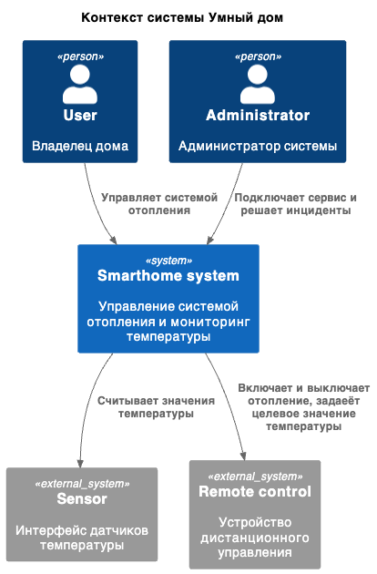
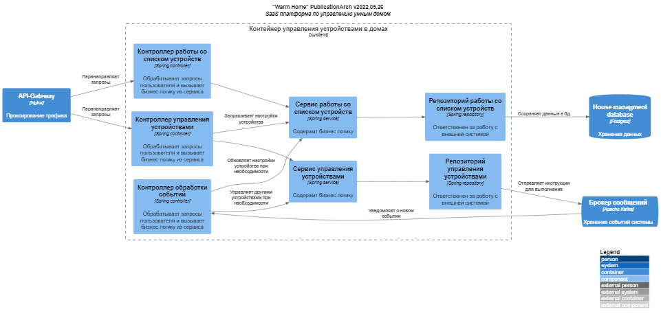

# Project_template

# Задание 1. Анализ и планирование

### 1. Описание функциональности монолитного приложения

**Управление отоплением:**

Пользователи могут:

    - Включать/отключать отопление в доме.
    - Изменять данные о системе отопления в доме

**Мониторинг температуры:**

Пользователи могут:

    - Устанавливать целевое значение по температуре
    - Получать текущее значение температуры
**Система поддерживает**

    - Отправку команды на устройство и получение данных с него

### 2. Анализ архитектуры монолитного приложения

**Язык программирования:** Java  (фреймворк Spring)

**База данных:** PostgreSQL

**Архитектура:** Монолитное приложение.

**Взаимодействие:** Контролеры для каждого эндпоинта реагируют на вызов API (HeatingSystemService->PostGre).

**Масштабируемость:** Ограничена, так как сущность HeatingSystem соответствует записи в БД.

**Развёртывание:** Чтобы добавить новое устройство, приходится останавливать всё приложения.

### 3. Определение доменов и границы контекстов

    [System] Тёплый дом
     [Domain] Управление домом
        [SubDomain] Управление отоплением
          [Context] Включение отопления
                - Устройство
                - Время включения
          [Context] Выключение отопления
                - Устройство
                - Время выключения
    [Domain] Мониторинг дома
        [SubDomain] мониторинг отопления
          [Context] Сбор данных
            - Дом
            - Датчик
            - Значения датчика
            - Статус датчика
          [Context] Просмотр данных (Web-interface)
            - Дом
            - Датчик
            - Значения датчика
            - Статус датчика

### **4. Проблемы монолитного решения**

- проблемы масштабирования - требуется расширение клиентской базы
- отсутствие автоматического передачи команд (опроса датчиков)
- сложность управления командой разработки (параллельная разработка в выбранной парадигме очень сложна)
- плохой деплоймент

### 5. Визуализация контекста системы - диаграмма С4

# Задание 2. Проектирование микросервисной архитектуры

**Диаграмма контейнеров (Containers)**

**Диаграмма компонентов (Components)**

**Диаграмма кода (Code)**

# Задание 3. Разработка ER-диаграммы

# Задание 4. Создание и документирование API
Не выполнено